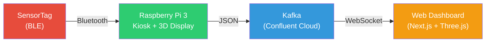

# SensorTag Digital Twin

A real-time IoT digital twin that mirrors a TI CC2650 SensorTag's orientation onto a 3D model — both on a Raspberry Pi touchscreen kiosk and a cloud-hosted web dashboard.

[](https://www.youtube.com/watch?v=eCy9f3EEhXs)

> Click the image above to watch the demo on YouTube.

---

## How It Works



1. **SensorTag** broadcasts IMU data (pitch, roll, yaw, accelerometer, gyroscope) over BLE
2. **Pi Kiosk** connects via Bluetooth, renders a live 3D model on its touchscreen, and streams data to Kafka
3. **Kafka** acts as the central message broker (Confluent Cloud)
4. **Web Dashboard** consumes the stream and renders a second 3D digital twin in the browser

Both the kiosk and the web dashboard use the same STL model files from the original TI CAD designs.

## Tech Stack

| | Technology |
|---|---|
| **Edge** | Raspberry Pi 3, Qt6/QML, QtQuick3D, EGL/KMS (no X11) |
| **Streaming** | Confluent Cloud Kafka (SASL/SSL) |
| **Web** | Next.js 16, React Three Fiber, Three.js, Tailwind CSS v4 |
| **Sensor** | TI CC2650 SensorTag (9-axis IMU over BLE) |

## Quick Start

**Kiosk** (on the Pi):
```bash
cd ~/kiosk/src && qmake6 kiosk.pro && make -j4
sudo systemctl restart kiosk
```

**Web Dashboard**:
```bash
cd web && npm install && npm run dev:all
```
Opens at `http://localhost:3000` with Kafka bridge on `ws://localhost:3001`.

## Documentation

For detailed architecture, diagrams, and implementation details see **[docs/ARCHITECTURE.md](docs/ARCHITECTURE.md)**.
