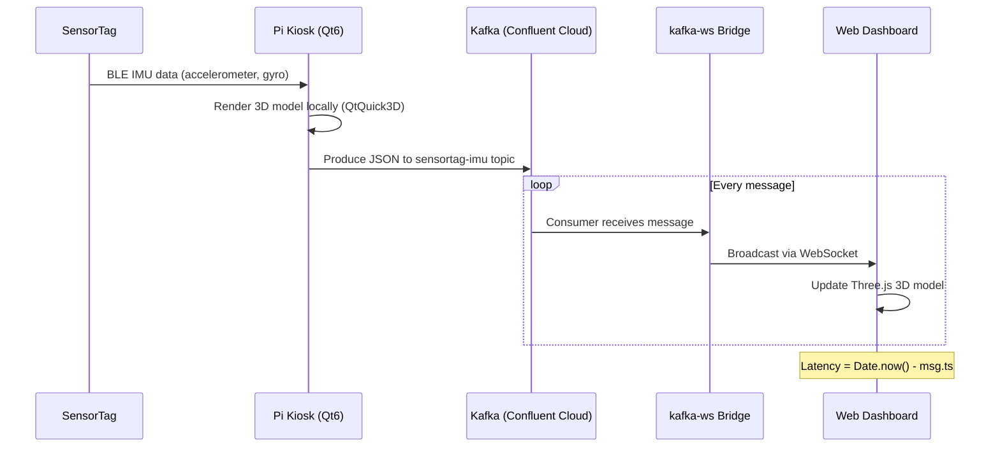
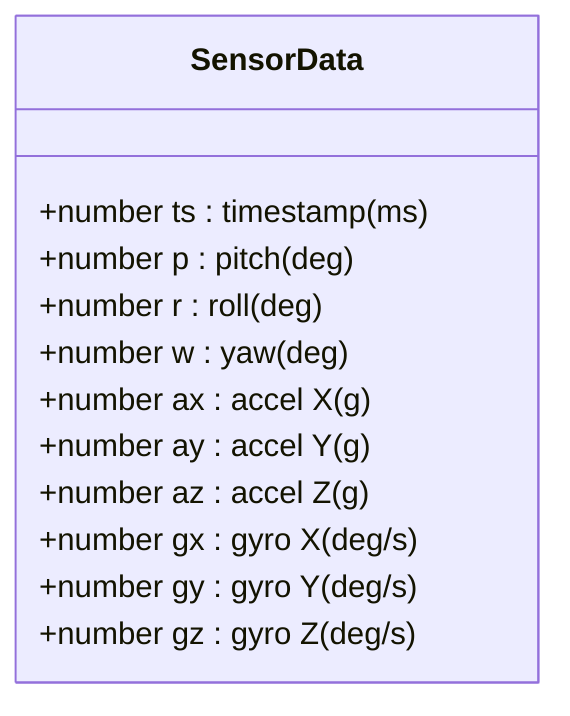
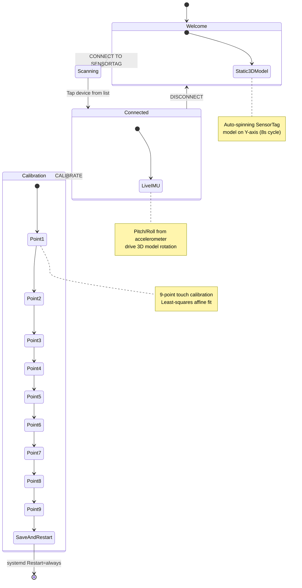
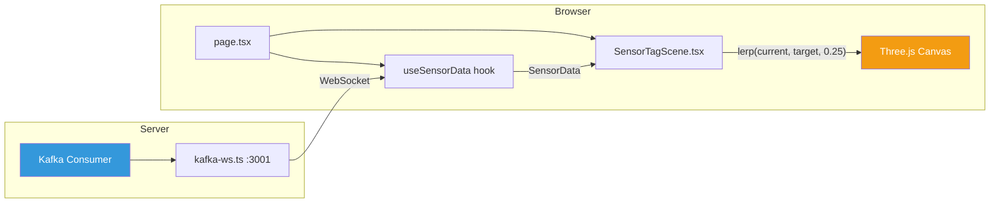

# Architecture

Detailed technical documentation for the SensorTag Digital Twin system.

---

## End-to-End Data Flow



## Sensor Data Schema

Every Kafka message on the `sensortag-imu` topic is a JSON object:



```json
{ "ts": 1710720000000, "p": 12.3, "r": -4.1, "w": 0.8, "ax": 0.01, "ay": -0.02, "az": 1.0, "gx": 0.5, "gy": -0.3, "gz": 0.1 }
```

---

## System Components

```mermaid
graph TB
    subgraph "Raspberry Pi 3"
        direction TB
        SVC[systemd kiosk.service] --> BIN[/usr/local/bin/kiosk/]
        BIN --> QML[main.qml - UI & 3D]
        BIN --> CPP[main.cpp - Calibrator]
        ENV[/etc/kiosk.env] -.->|EnvironmentFile| SVC
        CAL[/etc/pointercal] -.->|touch calibration| CPP
        DRM[DRM/EGL Framebuffer] --> LCD[Joyit 5in HDMI LCD]
        BLE[hci0 Bluetooth] --> TAG[CC2650 SensorTag]
    end

    subgraph "Web Stack"
        direction TB
        NEXT[Next.js 16 App] --> SCENE[SensorTagScene.tsx - Three.js]
        NEXT --> HOOK[useSensorData.ts - WebSocket Hook]
        KAFKA_WS[kafka-ws.ts] -->|ws://localhost:3001| HOOK
        KAFKA[Confluent Cloud Kafka] -->|Consumer Group| KAFKA_WS
    end

    BIN -->|Kafka Producer| KAFKA

    style SVC fill:#27ae60,color:#fff
    style NEXT fill:#f39c12,color:#fff
    style KAFKA fill:#3498db,color:#fff
```

---

## Kiosk App Screens

The kiosk is a 3-screen BLE application with a touch calibration flow:



### Touch Calibration

The Joyit 5" LCD uses an ADS7846 resistive touchscreen. Calibration works by:

1. Displaying 9 crosshair targets at known screen positions
2. Recording the raw touch coordinates for each tap
3. Computing a least-squares affine fit: `corrected = m * raw + b` for both axes
4. Saving coefficients to `/etc/pointercal`
5. Restarting via systemd to apply

---

## Boot Sequence

The Pi boots to the kiosk in ~12 seconds from power-on:

```mermaid
gantt
    title Pi 3 Boot Timeline (~12s to kiosk)
    dateFormat s
    axisFormat %S s

    section Kernel
    Kernel boot           :k1, 0, 4s

    section Hardware
    DRM card0 ready       :h1, 4, 8s

    section Kiosk
    systemd starts kiosk  :a1, 8, 10s
    3D scene rendered     :a2, 10, 12s

    section Network
    WiFi association      :n1, 10, 22s
```



### Boot Optimizations

- Disabled cloud-init (saved ~58s), ModemManager, serial gettys, fstrim
- Kernel args: `quiet loglevel=3 noresume elevator=noop`
- Firmware: `boot_delay=0`, `disable_splash=1`
- Graphics: `dtoverlay=vc4-kms-v3d`, `gpu_mem=128`
- No X11/Wayland — Qt renders directly to DRM/EGL framebuffer

---

## Web Dashboard

The web dashboard is a Next.js app that displays a live 3D digital twin of the SensorTag.



### Key implementation details

- **Smooth rotation**: 3D model uses linear interpolation (lerp factor 0.25) for fluid motion
- **Latency tracking**: Dashboard shows end-to-end latency (`Date.now() - msg.ts`)
- **Debug overlay**: Live readout of all 9 IMU axes + connection status
- **SSR disabled**: `SensorTagScene` loads client-side only (WebGL + WebSocket)

---

## Hardware

| Component | Detail |
|-----------|--------|
| **Board** | Raspberry Pi 3 (BCM2837, 1GB RAM) |
| **Display** | Joyit 5" HDMI LCD v2, 1024x768 16bpp framebuffer |
| **Touchscreen** | ADS7846 resistive (SPI), 9-point calibration |
| **Bluetooth** | hci0, BLE for SensorTag connectivity |
| **Sensor** | TI CC2650 SensorTag (9-axis IMU) |
| **Network** | WiFi only (wlan0), no Ethernet |
| **Graphics** | DRM/EGL via `vc4-kms-v3d`, 128MB GPU memory |

---

## Project Structure

```
pi3/
├── kiosk/                        # Qt6 kiosk app (runs on Pi)
│   ├── main.cpp                  # BLE manager, Kafka producer, touch calibrator
│   ├── main.qml                  # QML UI: 3D views, BLE flow, calibration
│   ├── kiosk.pro                 # qmake6 project file
│   ├── qml.qrc                   # Qt resource definitions
│   └── meshes/                   # Qt3D mesh files
│       ├── sensortag_box.mesh
│       ├── sensortag_jacket.mesh
│       └── sensortag_lid.mesh
├── web/                          # Next.js web dashboard
│   ├── app/
│   │   ├── page.tsx              # Dashboard page with debug overlay
│   │   ├── layout.tsx            # Root layout + fonts
│   │   └── globals.css           # Tailwind v4 theme
│   ├── components/
│   │   └── SensorTagScene.tsx    # React Three Fiber 3D scene
│   ├── lib/
│   │   └── useSensorData.ts      # WebSocket hook for live IMU
│   ├── server/
│   │   └── kafka-ws.ts           # Kafka consumer -> WebSocket bridge
│   └── public/models/
│       ├── box.stl               # SensorTag enclosure mesh
│       └── jacket.stl            # SensorTag jacket mesh
├── web-assets/
│   └── STL/                      # Original TI CAD files
└── docs/
    └── ARCHITECTURE.md           # This file
```
